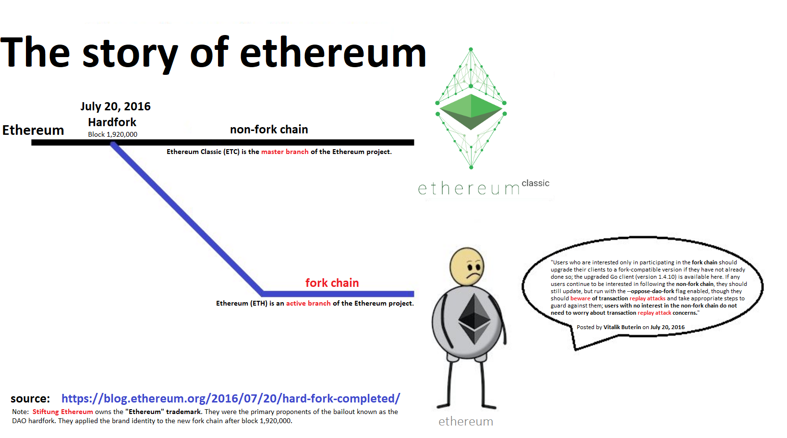
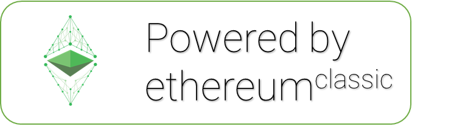
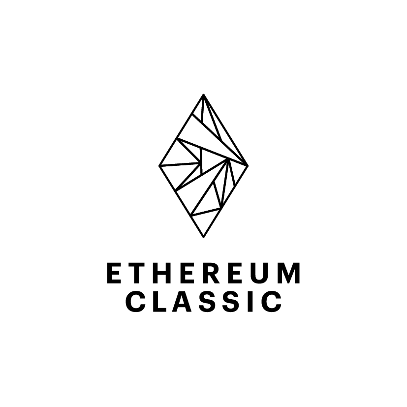
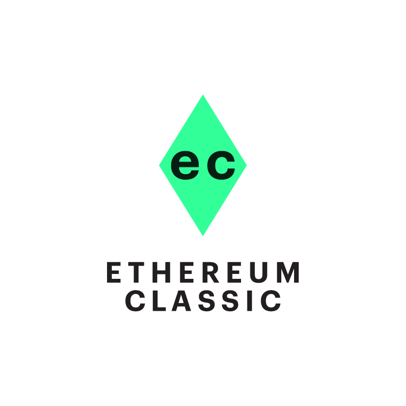

| Ethereum Classic |
| --- |
|  |
| website: *https://ethereumclassic.org* |
| code repository: *https://github.com/ethereumclassic* |
| ticker symbol: *ETC* |
| genesis block: 2015-07-30 |
| updated: *2020-01* |
|  |

  
  

 

A non-exhaustive list related to the <a href="https://ethereumclassic.org/">Ethereum Classic</a> network.
 
<a href="https://ethereumclassic.org/">Ethereum Classic</a> is an open-source, blockchain and smart contract computing platform.

# Ethereum Classic Awesome List

**Disclaimer:**
- Use links at your own risk. We try to vet links as best we can, but there is no guarantee that links haven't been tampered with after our initial inspection.
- This list is curated by the public. If a link is broken, malicious, or you want to add a link; then please make a pull request and review `contributing.md`.

- [Overview](#overview)
- [Ethereum Classic Network](#ethereum-classic-network)
  * [Ethereum Classic Virtual Machine Chains](#ethereum-classic-virtual-machine-chains)
  * [Ethereum Classic Network Clients](#ethereum-classic-network-clients)
  * [Node Deployment Tools](#node-deployment-tools)
  * [Network Public Utilities](#network-public-utilities)
    + [Gas Fee Estimators](#gas-fee-estimators)
    + [Dapp Aggregators](#dapp-aggregators)
    + [DeFi Open Finance Analytics](#defi-open-finance-analytics)
- [Ethereum Classic Ecosystem](#ethereum-classic-ecosystem)
  * [Dapp Environment](#dapp-environment)
    + [Games](#games)
    + [Compatible Decentralized Identity Dapps](#compatible-decentralized-identity-dapps)
    + [Interoperability Projects](#interoperability-projects)
    + [Open Finance Dapps and Protocols](#open-finance-dapps-and-protocols)
    + [Other Projects](#other-projects)
  * [Centralized Exchanges](#centralized-exchanges)
  * [Decentralized Exchanges](#decentralized-exchanges)
  * [Instant Exchanges](#instant-exchanges)
  * [Ethereum Classic Wallets](#ethereum-classic-wallets)
    + [Browser Wallets](#browser-wallets)
    + [Hardware Wallet](#hardware-wallet)
    + [Software Wallets](#software-wallets)
- [Ethereum Classic Participants](#ethereum-classic-participants)
  * [Community Channels](#community-channels)
    + [Chat](#chat)
    + [Forum](#forum)
    + [Media](#media)
    + [Repository](#repository)
    + [Twitter](#twitter)
    + [Websites](#websites)
  * [Development Teams](#development-teams)
  * [Miner Software](#miner-software)
  * [Mining Pools](#mining-pools)
- [Development Resources](#development-resources)
  * [Tooling](#tooling)
  * [Tutorials](#tutorials)
- [Educational Material](#educational-material)
  * [Technical Papers](#technical-papers)
  * [Ethereum Project Wiki](#ethereum-project-wiki)
  * [Code Documentation](#code-documentation)
  * [Ethereum Project Theory](#ethereum-project-theory)
  * [Ethereum Technology Philosophy](#ethereum-technology-philosophy)
    + [the Ethereum Project and the greater EVM ecosystem.](#the-ideas-behind-the-ethereum-project-and-the-greater-evm-ecosystem)
    + [the Ethereum Classic chain (ETC).](#the-ideas-behind-the-continuation-of-the-original-ethereum-project-and-the-ethereum-classic-chain--etc-)
  * [Proof of Work](#proof-of-work)
    + [Dagger Hashimoto](#dagger-hashimoto)
    + [Ethash](#ethash)
  * [Protocols](#protocols)
    + [Swarm](#swarm)
    + [Whisper](#whisper)
    + [zk-SNARKS](#zk-snarks)
  * [Token Bonding Curves (TBC)](#token-bonding-curves--tbc-)
- [Media and Other Content](#media-and-other-content)
  * [Blogs, Mailing Lists, Newsletters](#blogs--mailing-lists--newsletters)
  * [Books](#books)
  * [Videos](#videos)
- [Ethereum Classic Awesome List Resources](#ethereum-classic-awesome-list-resources)
  * [How to Contribute to the Ethereum Classic Awesome List](#how-to-contribute-to-the-ethereum-classic-awesome-list)
  * [License](#license)

<small><i><a href='http://ecotrust-canada.github.io/markdown-toc/'>Table of contents generated with markdown-toc</a></i></small>

# Overview
>Launched on July 30, 2015, Ethereum Classic is a distributed blockchain computing platform for smart contracts and decentralized applications. Its native token is ether (ETC), which primarily serves as a reserve currency for transactions on the Ethereum Classic network. In the greater, interoperable Ethereum Virtual Machine (EVM) ecosystem, Ethereum Classic is the original, *unaltered state* Ethereum chain.

**Ethereum project splits in a contentious hard fork**
>On July 20, 2016, an event known as ["the DAO hack"](https://www.cryptocompare.com/coins/guides/the-dao-the-hack-the-soft-fork-and-the-hard-fork/) resulted in a contentious hard fork of the Ethereum project. An unnamed sister chain with an irregular state change was born. The rights to the Ethereum project's brand are owned by the Ethereum Foundation, a non-profit organization that was a proponent of the new sister chain. The Ethereum Foundation applied their "Ethereum" brand and "ETH" ticker symbol to the new sister chain.

  
  

**Rebranding from Ethereum (ETH) to Ethereum Classic (ETC)**

>Initially, Ethereum Classic was only traded publicly on Bitsquare (now called [Bisq](https://bisq.network/markets/?currency=etc_btc)) and within a forum post on [bitcointalk.org](https://bitcointalk.org). On July 23, 2016, [Poloniex](https://poloniex.com) recognized Ethereum Classic by listing it on their exchange and opening the first [ETC/BTC](https://poloniex.com/exchange#btc_etc) market. Proponents of the unaltered, original state Ethereum chain adopted the new brand identity of "Ethereum Classic", the color green, and the "ETC" ticker symbol. A formal [Declaration of Independence](https://ethereumclassic.org/DeclarationOfIndependence/) was issued to the world and the unaltered, original state Ethereum chain rose from the ashes of its most notable social engineering attack. ( *[Source](https://coinjournal.net/night-poloniex-listed-ethereum-classic/)* )

# Ethereum Classic Network

   
  <b>Ticker Symbol:</b>  <a href="https://messari.io/asset/ethereum-classic/" alt="Ethereum Classic Ticker">ETC</a> 
  <b>Asset Details:</b>  <a href="https://messari.io/asset/ethereum-classic/profile" alt="Ethereum Classic">Ethereum Classic Profile</a>

## Ethereum Classic Virtual Machine Chains

source: [EthereumVM.net](http://ethereumvm.net/)

| Name | Short Name | Chain | Chain ID | Network | Network ID | Repository | Consensus Mechanism | Mining Algorithm |
| --- | :---: | :---: | :---: | :---: | :---: | :---: | :---: | :---: |
| Ethereum Classic | etc | ETC | 61 | mainnet | 1 | [source code](https://github.com/ethereumclassic) | Proof-of-Work (PoW) | Ethash |
| Testnet Astor |  | ETC |  | testnet |  | [source code](https://astor.host/) | Proof-of-Work (PoW) | Keccak256 |
| Testnet Kotti | kot | ETC | 6 | kotti | 6 | [source code](https://github.com/goerli/testnet) | Proof-of-Authority (PoA) | Clique |
| Testnet Mordor | metc | ETC | 63 | testnet | 7| [source code](https://github.com/eth-classic/mordor) | Proof-of-Work (PoW) | Ethash |

## Ethereum Classic Network Clients

| Client Name | Status | Repository |
| :---: | :---:| --- |
| [Hyperledger Besu](https://besu.hyperledger.org/) | Maintained | [releases](https://github.com/hyperledger/besu/releases) |
| [Multi-Geth](https://multi-geth.org/) | Maintained | [releases](https://github.com/multi-geth/multi-geth/releases) |
| [Parity-Ethereum](https://www.parity.io/) | Maintained | [releases](https://github.com/paritytech/parity-ethereum/releases) |

## Node Deployment Tools

- [Bloq Cloud](https://bloq.cloud/) - BloqCloud delivers highly-optimized, always available access to blockchain networks. Connect quickly and scale easily based on your needs -- without having to worry about managing infrastructure.
- [DappNode](https://dappnode.io/) - DAppNode facilitates running nodes, DApps and hosting P2P networks and economies.
- [Ethercluster](https://www.ethercluster.com/) - Ethercluster is an open-sourced Ethereum Virtual Machine (EVM) Remote Procedure Call (RPC) providing Ethereum Classic (ETC) and Kotti endpoints for free.
- [QuikNode](https://quiknode.io/) - QuikNodes are easy, always on, with a fast internet connection for quick blockchain sync, and you never have to worry about running out of disk space.

## Network Public Utilities

| Network | Block Explorers| Monitors | Faucets | Public Endpoints |
| :---: | --- | --- | :---: | :---: |
| [Ethereum Classic](https://ethereumclassic.org) | [BlockScout](https://blockscout.com/etc/mainnet/), [Emerald Receipt](https://receipt.emeraldpay.io/) [ETCBlockExplorer](https://etcblockexplorer.com/), [ETCPlanet](https://etcplanet.org/), [EthereumMain.net](http://ethereummain.net/), [Expedition](https://expedition.dev/?network=mainnet), [MinerGate](https://minergate.com/blockchain/etc/blocks), [TheMinersPond](https://theminerspond.com/ethereumclassic/explorer/home), [Tokenview](https://etc.tokenview.com/) | [2Miners](https://2miners.com/etc-stats/), [CoinMetrics](https://coinmetrics.io/charts/#assets=etc), [CoinWarz](https://www.coinwarz.com/mining/ethereum-classic), [Emerald Insights](https://insights.emeraldpay.io/), [ETCNodes](https://etcnodes.org/), [ETCStats](http://etcstats.org), [ETCStatus](https://etcstatus.live/), [EtherStats](http://etc.etherstats.net), [MiningPoolStats](https://miningpoolstats.stream/ethereumclassic), [Nanopool](https://etc.nanopool.org/stats), [WhatToMine](https://whattomine.com/coins/162-etc-ethash) | x | [BlockScout](https://blockscout.com/etc/mainnet/api_docs), [Ethercluster](https://www.ethercluster.com/etc) |
| [Astor](https://astor.host/) | [Astor Explorer](https://explore.astor.host/), [BlockScout](https://blockscout.com/etc/astor/), [EthereumTest.net](http://astor.ethereumtest.net) | [Astor Stats](https://stats.astor.host/), [BlockScout](https://blockscout.com/etc/astor/) [ETCStats](http://astor.etcstats.org), [EtherStats](http://astor.etherstats.net) | [1](https://faucet.astor.host), [2](http://astor.etherdrip.net) | [Ethercluster](https://www.ethercluster.com/astor) |
| [Kotti](https://github.com/goerli/testnet) | [BlockScout](https://blockscout.com/etc/kotti/), [EthereumTest.net](http://kotti.ethereumtest.net), [Expedition](https://expedition.dev/?network=kotti) | [BlockScout](https://blockscout.com/etc/kotti/), [ETCNodes](https://kotti.etcnodes.org/), [ETCStats](http://kotti.etcstats.org), [EtherStats](http://kotti.etherstats.net), [Kotti Stats](http://stats.kotti.goerli.net/), [Expedition](https://expedition.dev/?network=kotti) | [1](http://kottifaucet.me/), [2](http://kotti.etherdrip.net) | [Ethercluster](https://www.ethercluster.com/kotti) |
| [Mordor](https://github.com/eth-classic/mordor) | [BlockScout](https://blockscout.com/etc/mordor/), [EthereumTest.net](http://mordor.ethereumtest.net), [Expedition](https://expedition.dev/?network=mordor) | [BlockScout](https://blockscout.com/etc/mordor/), [ETCStats](http://mordor.etcstats.org), [EtherStats](http://mordor.etherstats.net), [Expedition](https://expedition.dev/?network=mordor) | [1](http://mordor.canhaz.net/), [2](http://mordor.etherdrip.net) | [Ethercluster](https://www.ethercluster.com/mordor) |

### Gas Fee Estimators

- [ETCGas](http://etcgas.net)
- [EtherGas](http://etc.ethergas.net)
- [ETHGasStation](https://ethgasstation.info/)
- [Expedition](https://expedition.dev/?network=mainnet)
- [GasGauge](http://etc.gasgauge.org)

### Dapp Aggregators

- [CryptoGround](https://www.cryptoground.com/dapp)
- [CoinCodex](https://coincodex.com/dapp-list/)
- [Dapp.com](https://www.dapp.com/ja/search)
- [DappDirect](https://dappdirect.net/)
- [DappRadar](https://dappradar.com/)
- [Dapp.Review](https://dapp.review/explore)
- [DappStatus](https://dappstatus.com/)
- [State of the Dapps](https://www.stateofthedapps.com/)

### DeFi Open Finance Analytics

- [0xTracker](https://0xtracker.com/)
- [CoinInterestRates](https://coininterestrates.com/)
- [DeFiScan](https://defiscan.io/)
- [DeFi Prime](https://defiprime.com/)
- [DeFi Pulse](https://defipulse.com/)
- [LoanScan](https://loanscan.io/)
- [UniswapROI](https://www.uniswaproi.com/)
- [Whois0x](https://whois0x.io/)

# Ethereum Classic Ecosystem

  

## Dapp Environment

### Games

- [Alien Farm](https://alienfarm.highlander.network/) - Idle Alien Farm is the #1 Alien farming simulator and idle game on the blockchain. The more Alien you have, the more eggs they lay (each Alien lays at a rate of 1 per day). Hatch more Alien with your eggs to multiply your production, or cash them out for ETC!
- [Arena Racing](https://arena.highlander.network/) - 5 players enter the stage to race to the finish. Every player pays 0.1 ETC to race. 1 player in the Arena loses the race but receives dividends from P3C which is bought every round and is locked up in the contract.
- [ETCOdyssey](https://etcodyssey.com/) - Upgrade your ships to avoid raiders looking to steal your Dark Matter & Star Dust. Fuse in game StarDust for a percentage of the pot or convert your StarDust for ONEX Network tokens sent with 1 transaction to your wallet.
- [Luckygames](https://luckygames.cc/) - Ethereum Classic Dice and Gambling site.

### Compatible Decentralized Identity Dapps
- [Bloom](https://bloom.co/) - BloomID eliminates the need for usernames and passwords. Simply scan a BloomID-enabled QR code or click “Log In with Bloom” to securely access apps and websites. Log In with Bloom helps mitigate fraud and prevents you from falling victim to credential stuffing attacks.
- [Civic](https://www.civic.com/) - Through our decentralized architecture with the blockchain and biometrics on the mobile device, our platform provides multi-factor authentication without a username, password, third-party authenticator, or physical hardware token.
- [OriginalMy](https://originalmy.com/) - Building trust in corporate governance. Seamlessly authenticating: identities, authorisation signatures, and digital content.
a global public utility for self-sovereign identity
- [Stampery](https://stampery.com/) - We leverage blockchain technology to ensure the existence, integrity and attribution of communications, processes and data important for your organization.
- [uPort](https://www.uport.me/) - At uPort, we build trusted ecosystems that let you, your partners and customers share data in a simple, secure, privacy-preserving way.

### Interoperability Projects
- [Binance Chain to Ethereum networks](https://docs.tokenbridge.net/eth-bnc-bridge/about-eth-bnc-bridge) - The ETH-to-BNC bridge combines the TokenBridge approach with a TSS to approve relay operations and facilitate asset transfer between an EVM chain and the Binance chain.
- [TokenBridge](https://docs.tokenbridge.net/) - The TokenBridge allows users to transfer data (e.g. digital asset ownership information) between two chains in the Ethereum ecosystem. Cross-chain bridges provide fast and secure connections between blockchains, creating scalability and connection - interoperability - between Ethereum networks.
- [wBTC](https://www.wbtc.network/) - Wrapped Bitcoin delivers the power of Bitcoin
with the flexibility of an ERC20 token
- [wETC](https://wetc.app/) - The Ethereum Classic Bridge connects ETC to ETH, where ETC is available as WETC on the Ethereum (ETH) chain.

### Open Finance Dapps and Protocols
- [Commonwealth](https://commonwealth.gg) - The World’s Savings Fund. Immutable. Built 2018.
- [ePOC](https://etc.poc35.co/) - Proof-of-Stake Token on Ethereum Classic Network. This is an alternative method to the more widely known process used by bitcoin; Proof of Work (POW).
- [GitCoin](https://gitcoin.co/) - Crowdfunding and Freelance Developers for Open Source Software Projects.
- [ONEX Network](https://onex.network/) - Proof-of-Stake Token on Ethereum Classic Network. This is an alternative method to the more widely known process used by bitcoin; Proof of Work (POW).

### Other Projects
- [Grayscale® Ethereum Classic Trust](https://grayscale.co/ethereum-classic-trust/) - Grayscale Ethereum Classic Trust enables investors to gain exposure to the price movement of ETC through a traditional investment vehicle, without the challenges of buying, storing, and safekeeping ETC.
- [Portal.Network](https://www.portal.network/) - Blockchain Name Service enables connections with IPFS hash, smart contract, and wallet address.

Note: If your dapp is not listed, please reach out to the community via the Ethereum Classic [Discord](https://discordapp.com/invite/HW4GckH).

## Centralized Exchanges

- [Binance](https://www.binance.com/en/trade/ETC_USDT)
- [Binance US](https://www.binance.us/en/trade/ETC_USD)
- [Bitfinex](https://www.bitfinex.com/t/ETC:USD)
- [Bithumb](https://www.bithumb.com/trade/order/ETCKRW)
- [Bittrex](https://bittrex.com/Market/Index?MarketName=USD-ETC)
- [Coinbase Pro](https://pro.coinbase.com/trade/ETC-USD)
- [Gate.io](https://gate.io/trade/etc_usdt)
- [HitBTC](https://hitbtc.com/ETC-to-USDT)
- [Huobi Global](https://www.huobi.com/en-us/exchange/etc_usdt/)
- [Huobi Korea](https://www.huobi.co.kr/en-US/exchange/etc_usdt/)
- [Kraken](https://trade.kraken.com/markets/kraken/etc/usd)
- [Kucoin](https://www.kucoin.com/trade/ETC-USDT)
- [OKCoin](https://www.okcoin.com/spot/trade#product=etc_usd)
- [OKEx](https://www.okex.com/market?product=etc_usdt)
- [OKEx Korea](https://okex.co.kr/kr/view/trade/order)
- [Poloniex](https://poloniex.com/exchange#usdt_etc)
- [Upbit](https://upbit.com/exchange?code=CRIX.UPBIT.KRW-ETC)
- [Yobit](https://yobit.net/en/trade/ETC/BTC)

## Decentralized Exchanges

- [Bisq](https://bisq.network/markets/?currency=etc_btc) - an open-source, peer-to-peer application that allows you to buy and sell cryptocurrencies in exchange for national currencies. No registration required.
- [EXNCE](https://exnce.com/) - an open source hybrid digital asset exchange service which supports new and established digital currencies on a convenient and seamless platform through which anyone can join, distribute airdrop crypto currencies.
- [Saturn Network](https://www.saturn.network/) - the future of trustless, privacy-preserving, censorship resistant decentralized exchanges for any blockchain that supports smart contracts.
- [Uniswap](https://uniswap.io/) - a protocol for automated token exchange on Ethereum. Second state is implementing this protocol on Ethereum Classic.

## Instant Exchanges
*Note:* Instant Exchanges typically offer worse rates than Centralized Exchanges.

- [Changelly](https://changelly.com/)
- [ChangeNow](https://changenow.io/)

Note: If your exchange is not listed, please reach out to the community via the Ethereum Classic [Discord](https://discordapp.com/invite/HW4GckH).

## Ethereum Classic Wallets

### Browser Wallets

- Interactive Browser Wallets: can be used as stand-alone wallets and as interfaces to connect through a web3 wallet or hardware wallet. *Not Recommended:* Keystores & Paper Wallets can be generated from these interfaces.
- Stand-alone Browser Wallets: are dedicated browser wallet with no downloads designed for desktop or mobile use.
- Web3 Wallets: are browser extensions for interacting with DApps built on Ethereum based networks.

| Interactive | Stand-Alone | Web3 |
| :---: | :---: | :---: |
| [MyCrypto](https://www.mycrypto.com) | [Portis](https://www.portis.io/) | [MetaMask](https://metamask.io/) |
| [MyEtherWallet](https://www.myetherwallet.com) | [Squarelink](https://squarelink.com/) | [Nifty Wallet](https://github.com/poanetwork/nifty-wallet) |
|  |  | [Opera](https://www.opera.com/crypto) |
|  |  | [Saturn Wallet](https://www.saturn.network/blog/saturn-wallet-user-manual/) |

### Hardware Wallet

are secure wallets designed for long term storage.

- [Bitski](https://www.bitski.com/)
- [Ledger](https://shop.ledger.com/)
- [SafePal](https://www.safepal.io/)
- [Trezor](https://trezor.io/)

### Software Wallets

for Desktop or Mobile devices.

- [AToken](https://www.atoken.com/)
- [Alpha Wallet](https://alphawallet.com/)
- [Atomic Wallet](https://atomicwallet.io/)
- [Button Wallet](https://buttonwallet.com/)
- [Citowise](https://citowise.com/)
- [Cobo](https://cobo.com/)
- [Coinbase Wallet](https://wallet.coinbase.com/)
- [Coinomi](https://www.coinomi.com/)
- [Cryptonator](https://www.cryptonator.com/)
- [Edge](https://edge.app/)
- [Emerald Wallet](https://emeraldpay.io/)
- [Ethos](https://www.ethos.io/universal-wallet/)
- [Exodus](https://www.exodus.io/)
- [Guarda](https://guarda.co/)
- [Infinito Wallet](https://www.infinitowallet.io/)
- [Jaxx](https://jaxx.io/)
- [Ownbit](https://ownbit.io/)
- [Trust Wallet](https://trustwallet.com/)

Note: If your wallet is not listed, please reach out to the community via the Ethereum Classic [Discord](https://discordapp.com/invite/HW4GckH).

# Ethereum Classic Participants

  

## Community Channels

### Chat
- [Discord](https://discordapp.com/invite/HW4GckH)
- Kakao: [Korea](https://open.kakao.com/o/gi4uNJ1)
- Matrix (Developer Chat): [Riot.im](https://riot.im/app/#/room/#ecips:matrix.org)
- Telegram: [Arabic](https://t.me/EtherClassic_Ar), [China](https://t.me/etczh), [English](https://telegram.me/ethclassic), [English](https://t.me/etcchat), [Español](https://t.me/ethclassicesp), [German](https://t.me/EtherCalssic_de), [Italia](https://t.me/ETC_Italia), [Russia](https://telegram.me/etcrussia), [Russia](https://telegram.me/etcru), [Viet Nam](https://t.me/ETCVietnam)
- Tencent QQ: ETC Asia-769408114
- WeChat: [insert link] *Note:* source QR images from ETC Coop and Chinese Websites.

### Forum
- Reddit: [r/EthereumClassic](https://www.reddit.com/r/EthereumClassic/)

### Media
- Podcast: [Let's Talk ETC!](https://www.youtube.com/playlist?list=PLKO8sMfwkZQqGH3Ny2OJ_SRcAvSf_0gx5)

### Repository
- [Github](https://github.com/ethereumclassic)

### Twitter
- Twitter: [China](https://twitter.com/EthereumChina), [China](https://twitter.com/ETCChina), [English](https://twitter.com/EthereumClassic), [English](https://twitter.com/eth_classic), [Español](https://twitter.com/ethclassicesp), [German](https://twitter.com/GermanyEtc), [Italia](https://twitter.com/etcitalia), [Japan](https://twitter.com/ETCJapan), [Korea](https://twitter.com/etckorea1), [Korea](https://twitter.com/ethclassic_kor), [Netherlands](https://twitter.com/etcnetherlands), [Pilipinas](https://twitter.com/ETC_Philippines), [Sri Lanka](https://twitter.com/etcSriLanka), [Viet Nam](https://twitter.com/ETCVietNam)

### Websites
- [EthereumClassic.org](https://ethereumclassic.org)
- International Community Sites: [Asia](http://ethereumclassicasia.org/), [China](http://ethereumclassic.cn/), [Korea](https://etckorea.modoo.at/), [Korea](https://www.ethereumclassickorea.com/)

Note: If your community channel is not listed, please reach out to the community via the Ethereum Classic [Discord](https://discordapp.com/invite/HW4GckH).

## Development Teams

| Year | Team Name | Twitter | Status | Repository |
| --- |--- | --- | :---: | --- |
| 2015 | [Ethereum Foundation](https://ethereum.org/) | [@ethereum](https://twitter.com/ethereum) | Active | [source code](https://github.com/ethereum/) |
| 2016 | [ETC Consortium](https://etcconsortium.org/) | [@ETCConsortium](https://twitter.com/ETCConsortium) | Active | |
| 2016 | [ETCDEV](https://etcdevteam.com/) | [@getemerald](https://twitter.com/getemerald) | Active | [source code](https://github.com/ETCDEVTeam/) |
| 2016 | [IOHK (Grothendieck)](https://iohk.io/projects/ethereum-classic/) | [@InputOutputHK](https://twitter.com/InputOutputHK) | Inactive | [source code](https://github.com/input-output-hk/mantis) |
| 2017 | [ETC Cooperative](https://etccooperative.org/) | [@ETCCooperative](https://twitter.com/ETCCooperative) | Active | [source code](https://github.com/ETCCooperative) |
| 2017 | [Ethereum Commonwealth](https://ethereumcommonwealth.github.io/ethereum-commonwealth-website/) | [@Dexaran](https://twitter.com/Dexaran) | Inactive | [source code](https://github.com/EthereumCommonwealth/) |
| 2018 | [Commonwealth.gg](https://commonwealth.gg) | [@commonwealthgg](https://twitter.com/commonwealthgg) | Active | [source code](https://github.com/p3c-bot) |
| 2018 | [ETC Labs](https://etclabs.org/) | [@etclabs](https://twitter.com/etclabs) | Active | [source code](https://github.com/etclabscore) |
| 2018 | [POA Network](https://www.poa.network/) | [@poanetwork](https://twitter.com/poanetwork) | Active | [source code](https://github.com/poanetwork) |
| 2019 | [ChainSafe](https://chainsafe.io/) | [@ChainSafeth](https://twitter.com/ChainSafeth) | Active | [source code](https://github.com/ChainSafe) |
| 2019 | [ETC Core](https://etccore.io/) | [@etc_core](https://twitter.com/etc_core) | Active | [source code](https://github.com/etclabscore) |
| 2019 | [Hyperledger](https://hyperledger.org/) | [@Hyperledger](https://twitter.com/Hyperledger) | Active | [source code](https://github.com/ChainSafe/besu) |
| 2019 | [Second State](https://www.secondstate.io/) | [@secondstateinc](https://twitter.com/secondstateinc) | Active | [source code](https://github.com/second-state) |

Note: If attribution is missing for your team, please reach out to the community via the Ethereum Classic [Discord](https://discordapp.com/invite/HW4GckH).

## Miner Software

Mining Algorithm: Ethash

| Windows AMD | Windows NVIDIA | Linux AMD | Linux NVIDIA |
| :---: | :---: | :---: | :---: |
| [Bminer](https://www.bminer.me/releases/) | | [Bminer](https://www.bminer.me/releases/) | |
| [Claymore Miner](https://bitcointalk.org/index.php?topic=1433925.0) | [Claymore Miner](https://bitcointalk.org/index.php?topic=1433925.0) | [Claymore Miner](https://bitcointalk.org/index.php?topic=1433925.0) | [Claymore Miner](https://bitcointalk.org/index.php?topic=1433925.0) |
| [Ethminer](https://github.com/ethereum-mining/ethminer/releases) | [Ethminer](https://github.com/ethereum-mining/ethminer/releases) | [Ethminer](https://github.com/ethereum-mining/ethminer/releases) | [Ethminer](https://github.com/ethereum-mining/ethminer/releases) |
| [Phoenix Miner](https://bitcointalk.org/index.php?topic=2647654.0) | [Phoenix Miner](https://bitcointalk.org/index.php?topic=2647654.0) | | |
| [Qtminer](http://cryptomining-blog.com/tag/qtminer/) | [Qtminer](http://cryptomining-blog.com/tag/qtminer/) | [Qtminer](https://github.com/etherchain-org/qtminer) | [Qtminer](https://github.com/etherchain-org/qtminer) |

Optimization: [minerOS Miner Butler](http://www.mineros.cn/#/home)

## Mining Pools

source: [MiningPoolStats.stream](https://miningpoolstats.stream/ethereumclassic)

Top 5 Mining Pools by Hashrate at the time for writing:
1. [Ethermine](https://etc.ethermine.org/)
2. [Nanopool](https://etc.nanopool.org/)
3. [MiningPoolHub](https://ethereum-classic.miningpoolhub.com/)
4. [2Miners](https://2miners.com/etc-mining-pool)
5. [Beepool](https://beepool.org/coindetail/etc)

# Development Resources

  

## Tooling

- [BUIDL IDE](https://buidl.secondstate.io/etc) - Second State BUIDL IDE is a web-based IDE that requires no software download or install. It provides a one-stop development and deployment environment for smart contract and dapp developers.
- [Dappkit](https://dappkit.io/) - A ledger-agnostic, high-performance infrastructure and libraries for developers to build and scale decentralized applications. In short, collaborative Firebase for Dapps.
- [Embark Framework](https://framework.embarklabs.io/) - Framework for serverless Decentralized Applications using Ethereum, IPFS and other platforms.
- [Emerald Platform](https://github.com/ETCDEVTeam/emerald-platform) - Platform for building Dapps for ETC blockchain.
- [ESerialize](https://eserialize.com/?input=string&output=hex) - The goal of this module is to provide easy functions to serialize and deserialize data for the Ethereum Stack.
- [Ethereum JSON-RPC API](https://github.com/etclabscore/ethereum-json-rpc-specification) - A specification of JSON-RPC methods that an EVM-based blockchain client must implement.
- [Eth Fiddle](https://ethfiddle.com/) - Online editor for smart contracts.
- [EVM-LLVM](https://github.com/etclabscore/evm_llvm) - Not only can developers use a large scope of programming languages (Rust for smart contracts!) other than Solidity to target the Ethereum Virtual Machine (EVM), they can also immediately benefit from various development tools built around LLVM infrastructure.
- [Ganache](https://www.trufflesuite.com/ganache) - Personal Ethereum blockchain to run tests.
- [Jade Suite](https://jade.builders/) - The Jade suite of tools empowers developers to create peer-to-peer decentralized applications on top of EVM-based blockchains like Ethereum Classic.
- [Mythx](https://mythx.io/) - MythX is the premier security analysis service for Ethereum smart contracts. Our mission is to ensure development teams avoid costly errors and make Ethereum a more secure and trustworthy platform.
- [Open-RPC](https://open-rpc.org/) - The OpenRPC Specification defines a standard, programming language-agnostic interface description for JSON-RPC 2.0 APIs.
- [OpenZeppelin](https://openzeppelin.org/) - Battle-tested framework of secure, reusable smart contracts.
- [Quorum](https://www.goquorum.com/) - Quorum is an open source blockchain platform that combines the innovation of the public Ethereum community with enhancements to support enterprise needs.
- [Remix Online IDE](https://remix.ethereum.org/) - A useful in-browser IDE that can compile and publish smart contracts to various Ethereum networks. Includes a linter.
- [SOLL](https://github.com/second-state/soll) - The LLVM compiler is finally coming to Solidity. With it, we can easily create smart contracts across multiple blockchain VMs. The EVM on Ethereum Classic and ETH 2.0's eWASM are among the first we support.
- [Sputnikvm](https://github.com/ETCDEVTeam/sputnikvm) - SputnikVM is an open source standalone implementation of Ethereum Virtual Machine (EVM). It aims to be an efficient, pluggable virtual machine for different Ethereum-based blockchains.
- [Truffle Suite](https://www.trufflesuite.com/) - A world class development environment, testing framework and asset pipeline for blockchains using the Ethereum Virtual Machine (EVM), aiming to make life as a developer easier.

## Tutorials

Step by step guides on using Ethereum.

- [CryptoZombies](https://cryptozombies.io/) - Learn to Code Ethereum DApps By Building Your Own Game.
- [Hitchhikers Guide to Smart Contracts](https://blog.zeppelin.solutions/the-hitchhikers-guide-to-smart-contracts-in-ethereum-848f08001f05) - Build smart contracts on Ethereum using Truffle, testrpc and Solidity.
- [A 101 Noob Intro to Programming Smart Contracts on Ethereum](https://medium.com/@ConsenSys/a-101-noob-intro-to-programming-smart-contracts-on-ethereum-695d15c1dab4) - Smart contract tutorial with a focus on building up understanding before code.
- [Parity DApp Tutorial](https://wiki.parity.io/Dapp-Tutorial) - 10 part tutorial on how to write DApps.
- [Start Ethereum DApp Development Career](https://www.reddit.com/r/ethereum/comments/9h0w83/start_ethereum_dapp_development_career_ultimate/) - Informal guide to starting developing DApps.
- [Full Stack DApp Tutorial Series](https://kauri.io/collection/5b8e401ee727370001c942e3/full-stack-dapp-tutorial-series) - Full stack DApps using various frameworks.
- [Ethereum Builders Guide](https://ethereumbuilders.gitbooks.io/guide/content/en/index.html) - Gitbook for building on Ethereum that goes deeper into understanding technical functionality.
- [Learning Solidity Tutorial Series](https://karl.tech/learning-solidity-part-1-deploy-a-contract/) - Building smart contracts with Metamask and Remix IDE.
- [End to End DApp Tutorial](https://medium.com/@merunasgrincalaitis/the-ultimate-end-to-end-tutorial-to-create-and-deploy-a-fully-descentralized-dapp-in-ethereum-18f0cf6d7e0e) - Create a gambling DApp using Metamask, Truffle, Remix, React and IPFS.
- [Various Ethereum & Solidity Tutorials](https://www.codementor.io/learn/blockchain/solidity-tutorials) - How to create smart contracts, deploy your own DApps, create tokens, and more — from beginner to intermediate topics.

# Educational Material

  

## Technical Papers

- [Ethereum Project White Paper](https://github.com/ethereumclassic/wiki/ethereum_white_paper.pdf) - Non-technical introductory description of the Ethereum project.
- [Ethereum Project Yellow Paper](https://github.com/ethereumclassic/wiki/ethereum_yellow_paper.pdf) - Technical description of the Ethereum project. Technically outdated, but interesting.

## Ethereum Project Wiki

- [Ethereum Classic chain's Wiki (ETC)](https://github.com/ethereumclassic/wiki/wiki) - Ethereum Classic wiki covering all things related to Ethereum Classic. The go-to place for all things Ethereum Classic (ETC) chain.
- [Ethereum chain's Wiki (ETH)](https://github.com/ethereum/wiki/wiki) - Ethereum wiki covering all things related to Ethereum. The go-to place for all things Ethereum (ETH) chain.
- [Ethereum chain's Community Wiki (ETH)](https://eth.wiki/) - Ethereum's ETH community wiki. An alternative wiki for the Ethereum chain (ETH).

## Code Documentation

- [Solidity Documentation](https://solidity.readthedocs.io) - Programming language of choice for smart contracts.
- [Vyper Documentation](https://vyper.readthedocs.io/en/latest/index.html) - Experimental smart contract programming language intended to replace Solidity.
- [Flint Documentation](https://docs.flintlang.org/) - Experimental contract orientated language for Ethereum.
- [POA Network](https://www.poa.network/) - POA Network encompasses an EVM blockchain as well as product development for the entire Ethereum ecosystem.

## Ethereum Project Theory

Learn about the theory behind the Ethereum project.

- [Ethereum Stack Exchange](https://ethereum.meta.stackexchange.com/questions/431/faq-frequently-asked-questions-and-reference-answers) - Question and answers about Ethereum.
- [Smart contract safety](https://github.com/ethereum/wiki/wiki/Safety) - Ethereum wiki on best practices for safety in smart contracts.
- [Accounts, Transactions, Gas, and Block Gas Limits in Ethereum](https://hudsonjameson.com/2017-06-27-accounts-transactions-gas-ethereum/) - Functional description of Ethereum accounts, gas and transactions.
- [Ethernaut Smart Contract Capture the Flag](https://ethernaut.zeppelin.solutions/) - Practice hacking Smart Contracts.
- [Ethereum Syllabus](https://novicedock.com/learn/cryptocurrency/ethereum) - Syllabus to learn Ethereum.
- [Cryptocurrency Security: University of Illinois 2016](http://soc1024.ece.illinois.edu/teaching/ece598am/fall2016/) - Cryptocurrency Security Course.
- [Stanford CS 251(p): Bitcoin and Crypto Currencies](https://crypto.stanford.edu/cs251_fall15/) - Stanford Bitcoin and Cryptocurrency Course.
- [Introduction to Digital Currencies: University of Nicosia](https://digitalcurrency.unic.ac.cy/free-introductory-mooc/) - Digital currency introductory MOOC.
- [Bitcoin and Blockchain Technology: Concordia University](https://users.encs.concordia.ca/~clark/courses/1703-6630/index.html) - Introduction to Bitcoin and blockchain technology MOOC.
- [Smart Contract Best Practices](https://consensys.github.io/smart-contract-best-practices/) - Security related best practices for smart contracts.
- [Low-Resource Eclipse Attacks on Ethereum’s Peer-to-Peer Network](https://www.cs.bu.edu/~goldbe/projects/eclipseEth.pdf)

## Ethereum Technology Philosophy

### The Ideas behind the Ethereum Project and the greater EVM ecosystem.

- [The idea of Smart Contracts](https://web.archive.org/web/20020316215014/http://szabo.best.vwh.net/idea.html) - Nick Szabo's idea of smart contracts post from 1997.
- [Bitcoin: A Peer-to-Peer Electronic Cash System](https://bitcoin.org/en/bitcoin-paper) - Satoshi Nakamoto's original paper is still recommended reading for anyone studying how Bitcoin works.
- [Making Smart Contracts Smarter](https://eprint.iacr.org/2016/633.pdf) - Smart contract security attacks.
- [Ethereum Classic (ETC) Wiki Philosophy](https://github.com/ethereumclassic/wiki/Philosophy) - Some of the core philosophies of Ethereum's ETC chain.
- [Ethereum Classic (ETC) Improvement Proposals](https://ecips.ethereumclassic.org/) - Standards for the Ethereum's ETC platform, including core protocol specifications, client APIs, and contract standards (ECIPs).
- [Ethereum (ETH) Wiki Philosophy](https://github.com/ethereum/wiki/Philosophy) - Some of the core philosophies of Ethereum's ETH chain.
- [Ethereum(ETH) )Improvement Proposals](https://eips.ethereum.org/) - Standards for Ethereum's ETH platform, including core protocol specifications, client APIs, and contract standards (EIPS).

### The ideas behind the continuation of the original Ethereum project and the Ethereum Classic chain (ETC).

*Note:* There are no centralized leaders in the Ethereum Classic EVM project.

- [The Ethereum Classic Declaration of Independence](https://ethereumclassic.org/blog/2016-08-13-declaration-of-independence/)
- [A Crypto-Decentralist Manifesto](https://ethereumclassic.org/blog/2016-07-11-manifesto/)
- [Ethereum Classic Principles](https://etherplan.com/2019/08/14/ethereum-classic-principles/8575/)
- [Ethereum Classic Vision](https://etherplan.com/2019/08/14/ethereum-classic-vision/8595/)
- [Ethereum Classic Opportunities](https://etherplan.com/2019/08/14/ethereum-classic-opportunities/8614/)
- [Ethereum Classic vs Ethereum 2.0, What is the Difference?](https://etherplan.com/2019/07/23/ethereum-classic-vs-ethereum-2-0-what-is-the-difference/8425/)
- [Why Proof of Stake is Less Secure Than Proof of Work](https://etherplan.com/2019/10/07/why-proof-of-stake-is-less-secure-than-proof-of-work/9077/)
- [How to Have a Vision for Ethereum Classic Without Creating a Governance Orgy](https://etherplan.com/2019/07/22/how-to-have-a-vision-for-ethereum-classic-without-creating-a-governance-orgy/8359/)
- [The Ethereum Classic vs Ethereum 1.x Dichotomy](https://etherplan.com/2019/09/18/the-ethereum-classic-vs-ethereum-1-x-dichotomy/8752/)

## Proof of Work

Ethereum Classic is committed to Proof of Work as a Consensus mechanism.

### Dagger Hashimoto
- [Dagger Hasimoto](https://github.com/ethereum/wiki/wiki/Dagger-Hashimoto) - Ethereum Classic's previous Proof of Work Algorithm.
### Ethash
- [Ethash](https://github.com/ethereum/wiki/wiki/Ethash) - Ethereum Classic's current Proof of Work Algorithm.
- [Ethash Design Rationale](https://github.com/ethereum/wiki/wiki/Ethash-Design-Rationale) - an explaination of Ethash's design.

## Protocols

Descriptions and implementations of Ethereum-related protocols.

### Swarm

- [Introduction to Swarm](https://swarm.ethereum.org/) - Swarm is a distributed storage platform and content distribution service.

### Whisper

- [Introduction to Whisper](https://github.com/ethereum/wiki/wiki/Whisper-pages) - A communication protocol for DApps to communicate with each other.

### zk-SNARKS

- [Introduction to zk-SNARKS with examples](https://media.consensys.net/introduction-to-zksnarks-with-examples-3283b554fc3b) - A practical overview of zk-SNARKS, verify knowledge of a secret without revealing it.
- [A practical beginner's guide to creating, proving, and verifying zkSNARKs](https://github.com/jstoxrocky/zksnarks_example) - Introduction to zk-SNARKS and implementation as a smart contract.
- [zk-SNARKS: Under the Hood](https://medium.com/@VitalikButerin/zk-snarks-under-the-hood-b33151a013f6) - Technical explanation of zk-SNARKS.
- [zk-SNARKs in a nutshell](https://blog.ethereum.org/2016/12/05/zksnarks-in-a-nutshell/) - Technical explanation of zk-SNARKS.
- [Practical zk-SNARKs for Ethereum EVM's](http://coders-errand.com/practical-zk-snarks-for-ethereum/) - A short and practical introduction to using zk-SNARKs.

## Token Bonding Curves (TBC)

- [Bonding Curves Explained](https://yos.io/2018/11/10/bonding-curves/) - Mathematically sound price-supply relationship curves., a thorough introduction to TBCs with code.
- [Token Bonding Curves in Practice](https://tokeneconomy.co/token-bonding-curves-in-practice-3eb904720cb8) - Exploring a universal distribution of IP via non-fungible tokens and curation markets.
- [Bonding Curve Playground](https://bondingplayground.netlify.com/) - An interactive bonding curve webapp.

# Media and Other Content

## Blogs, Mailing Lists, Newsletters

- [Etherplan](https://etherplan.com/) - Donald McIntyre's research, articles, & podcast about Ethereum Classic, Bitcoin, and decentralized applications.
- [Grayscale® Ethereum Classic Trust](https://grayscale.co/ethereum-classic-trust/) - Grayscale Ethereum Classic Trust enables investors to gain exposure to the price movement of ETC through a traditional investment vehicle, without the challenges of buying, storing, and safekeeping ETC.
- [Messari's Ethereum Classic News and Research](https://messari.io/asset/ethereum-classic/news) - Messari brings transparency to the cryptoeconomy. We want to help investors, regulators, and the public make sense of this revolutionary new asset class, and are building data tools that will drive informed decision making and investment.
- [Week in Ethereum News](https://weekinethereumnews.com/) - A summary of everything happening in Ethereum each week.
- [Ethereum Worldwide Meetups](https://www.meetup.com/find/?allMeetups=false&keywords=ethereum) - Meet up with the local Ethereum community via meetup.com.
- [ETC Gifs](https://github.com/stevanlohja/ETC_Gifs) - Ethereum Classic social media meme repository

## Books

- [Mastering Ethereum](https://github.com/ethereumbook/ethereumbook) - A developers guide to the operation and use of the Ethereum project.
- [Introduction to Ethereum and Solidity](https://the-eye.eu/public/Books/qt.vidyagam.es/library/humble-bitcoin-bundle/Introducing%20Ethereum%20and%20Solidity_%20Foud%20Blockchain%20Programming%20for%20Beginners/Introducing%20Ethereum%20and%20Solidity_%20Foundatiin%20Programming%20for%20Beginners%20-%20Chris%20Dannen.pdf) - Learn Solidity development from concept to deployment.
- [Ethereum: Blockchains, Digital Assets, Smart Contracts, Decentralized Autonomous Organizations](https://www.goodreads.com/book/show/32762240-ethereum) - Learn about Ethereum (and blockchains) from an IBM blockchain liaison.

## Videos

- [Ethereum Explained (22:00)](https://www.youtube.com/watch?v=-_Qs0XdPpw8) - Introductory explanation to the Ethereum platform.
- [A Guide to Building Your First Decentralized Application (37:00)](https://www.youtube.com/watch?v=gSQXq2_j-mw)
- [Ethereum YouTube Channel](https://www.youtube.com/user/ethereumproject) - Mostly older videos of Devcon 1 and before.
- [Ethereum Foundation YouTube Channel](https://www.youtube.com/channel/UCNOfzGXD_C9YMYmnefmPH0g) - Most up to date events and streams including the Ethereum Devcon conferences and dev meetings.

  

  

# Ethereum Classic Awesome List Resources

## How to Contribute to the Ethereum Classic Awesome List

Contributions welcome! Read the [contribution guidelines](contributing.md) first.
Inspired by [Awesome Python](https://github.com/vinta/awesome-python) and [Awesome Machine Learning](https://github.com/josephmisiti/awesome-machine-learning)

## License

  
   
  To the extent possible under law,
  <a rel="dct:publisher"
     href="https://github.com/gitr0n1n/Awesome-EthereumClassic">
    @gitr0n1n</a>
  has waived all copyright and related or neighboring rights to
  Awesome-EthereumClassic.
This work is published from:

  United States.

 For the full license see `LICENSE`.
